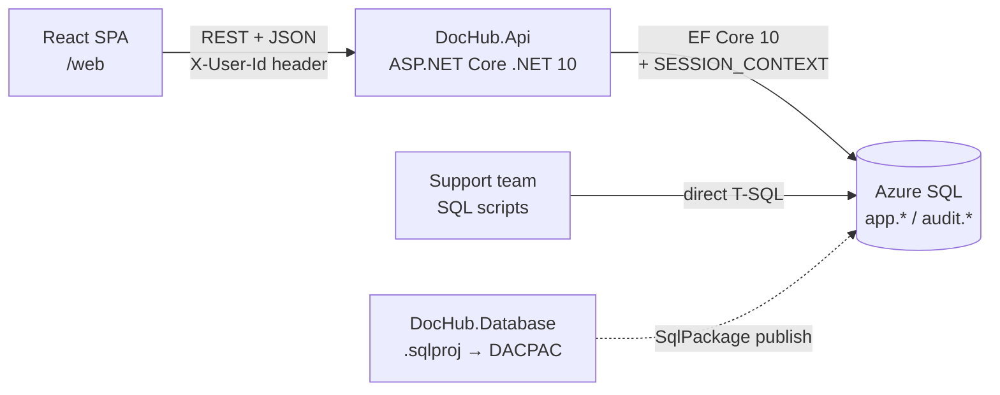

# Architecture & key decisions

## 1. High-level view

## 2. Decisions (ADR-lite)

### ADR-01 Database schema lives in an SDK-style SQL Database Project
- `database/DocHub.Database/DocHub.Database.sqlproj` using the `Microsoft.Build.Sql` SDK, target `SqlAzureV12`.
- Separate solution `database/DocHub.Database.slnx` (builds on any OS with `dotnet build`, produces a DACPAC).
- The project owns **every** DB object (tables, indexes, constraints, views, functions, stored procedures, triggers, security, seed) and is the **only** way to deploy (`SqlPackage` publish locally, in tests via DacFx, in CI/CD). CI also runs `SqlPackage /Action:DeployReport` against the test DB to detect drift (FR-D4).
- EF Core is used **database-first-by-hand**: entity configurations are written to match the schema; **no EF migrations**.
- Rationale: triggers, filtered indexes, check constraints, stored procedures and seed data are first-class and reviewable as SQL; deployments are declarative (`SqlPackage /Action:Publish`).

### ADR-02 Tree storage: adjacency list + sort order
- `DocumentNode(ParentNodeId, SortOrder)`; the full tree of a version is loaded with a single query (`WHERE DocumentVersionId = @id`) and assembled in memory (O(n)).
- Subtree operations (delete, permission checks, ancestors) use recursive CTEs or the in-memory tree.
- `hierarchyid` was rejected: harder to use with EF Core and moves require rewriting the subtree anyway.
- Sort order uses gaps (1024, 2048, …); a sibling set is renumbered when a gap is exhausted.

### ADR-03 Versioning by copy, identity by `LogicalNodeId`
- Every version owns a full copy of its nodes and contents. Creating a draft = deep copy in one transaction (set-based `INSERT … SELECT`).
- Each node carries `LogicalNodeId` (GUID), preserved across copies. Comparison, history, node-scoped permissions and comments key off it.
- Rationale: signed versions are immutable and self-contained; comparison is a simple join by `LogicalNodeId`.

### ADR-04 Change tracking in the database (triggers → `audit.ChangeLog`)
- `AFTER INSERT, UPDATE, DELETE` triggers on every tracked table write a row per changed record to `audit.ChangeLog` with old/new values as JSON (`FOR JSON`).
- **Who**: the API sets `SESSION_CONTEXT` keys `UserId` and `CorrelationId` on every opened connection (EF Core `DbConnectionInterceptor`). Triggers read them.
- **Scripts**: every change not made by the API is recorded with `Source = 'Script'`, `DbLogin = ORIGINAL_LOGIN()`. `Source = 'App'` requires the API context **and** a caller in the `app_api` role (or `db_owner` for local development), so a support script cannot pose as the API by setting `UserId`. Support scripts should start with `EXEC audit.usp_SetSupportContext @Ticket = 'INC-123', @Reason = '…'` so the ticket is recorded too.
- Rationale: application-level auditing (EF `SaveChanges` interceptor) cannot see script changes — a hard requirement. Temporal tables were considered but do not record *who* changed a row nor the reason; triggers do both. (Temporal tables can be added later for point-in-time queries if needed.)

### ADR-05 Rich text = schema-validated JSON modelled on Word (see [content-format.md](content-format.md))
- Canonical storage: TipTap/ProseMirror JSON (`ContentJson`) validated against DocHub Content Schema v1, whose attributes mirror WordprocessingML (styles, fonts, spacing, numbering, table grid/borders/shading).
- Derived: server-rendered `ContentHtml`, `PlainText`, SHA-256 `ContentHash` of canonical JSON.
- Rejected: HTML as canonical (weak fidelity, sanitizer attack surface, noisy diffs); OOXML as canonical (not editable in the browser, lossy round-trips).
- Diffs are computed server-side on the JSON block tree, word-level (`DiffPlex`), distinguishing text vs formatting changes.

### ADR-06 "Authentication" = Test mode (seeded users + header)
- `Auth:Mode = Test`: an authentication handler reads `X-User-Id` and builds a `ClaimsPrincipal` for a seeded, active user. Missing/unknown → `401`.
- `GET /api/system/info` returns `{ authMode: "Test", environment }`; the SPA shows the **"Acting as" user dropdown** and a TEST MODE banner only in this mode.
- Startup fails if `Auth:Mode = Test` in the `Production` environment unless `Auth:AllowTestModeInProduction = true` (explicit opt-in for demo environments).
- Designed so it can be swapped for Entra ID (JWT bearer) later without touching endpoints: everything uses `ICurrentUser`.

### ADR-07 API style
- Controllers (or Minimal API endpoint groups — pick one in T04 and use consistently), JSON camelCase, `ProblemDetails` for errors,
  `rowVersion` (base64) in DTOs for optimistic concurrency, built-in `Microsoft.AspNetCore.OpenApi` + Scalar UI.
- Layering is intentionally light: `Domain` (entities + rules), `Infrastructure` (EF, SQL, diff, content schema validator/renderer), `Api` (endpoints + application services). No MediatR/CQRS.

### ADR-09 Data access: EF Core for CRUD, stored procedures for hot read paths ([FR-D1…D6](requirements/11-data-access.md))
- All entity CRUD via EF Core (`DocHubDbContext`).
- Permission checks, document lists and search via stored procedures (`usp_CheckPermission`, `usp_GetEffectivePermissions`, `usp_ListDocuments`, `usp_SearchDocuments`, `usp_SearchInDocument`); set-based bulk operations too (`usp_CopyVersionToDraft`, `usp_DeleteSubtree`).
- Procedures are called through one thin infrastructure layer (`IDbProcedures` with one typed method per procedure; `Database.SqlQuery<T>` / `DbDataReader` for multi-result sets), always parameterized, running on the same connection so the session context (ADR-04) applies.
- Each procedure: DB tests for correctness + an API integration test comparing results with an EF reference query.

### ADR-08 Web UI: React SPA (confirmed)
- Vite + React + TypeScript, TanStack Query for server state, a tree component (e.g. `react-arborist`), TipTap with the table extension, TS API client generated from OpenAPI (`openapi-typescript` + `openapi-fetch`).
- In development the API serves CORS for the Vite dev server; in production the SPA can be hosted as static files by the API or by Azure Static Web Apps.

## 3. Standard error codes (ProblemDetails `type`)

| Code | HTTP | When |
|---|---|---|
| `validation-failed` | 400 | Invalid input |
| `unauthenticated` | 401 | Missing/unknown `X-User-Id` |
| `forbidden` | 403 | Role does not allow the operation |
| `not-found` | 404 | Entity missing (or soft-deleted, where applicable) |
| `version-not-editable` | 409 | Modifying a non-Draft version or a deleted document |
| `draft-already-exists` | 409 | Creating a second draft |
| `concurrency-conflict` | 409 | `rowVersion` mismatch |
| `invalid-move` | 409 | Moving a node/folder under itself or its descendant |
| `in-use` | 409 | Deleting a node type/style/folder that is referenced |
| `document-deleted` | 409 | Mutating a soft-deleted document |
| `not-deleted` | 409 | Restoring a document that is not deleted |
| `folder-missing` | 409 | Restoring without `folderId` when the original folder is gone |
| `no-signed-version` | 409 | Creating a draft when nothing is signed yet |
| `only-version` | 409 | Discarding the only version of a document |
| `no-approvers` | 409 | Signing a document that has no approvers |
| `duplicate-name` | 409 | Duplicate folder name among siblings, duplicate node-type code / style id |
| `duplicate-grant` | 409 | Granting an existing role again |
| `owner-cannot-have-role` | 400 | Granting a role to the owner |
| `target-has-role` | 400 | Transferring ownership to a user holding a grant |
