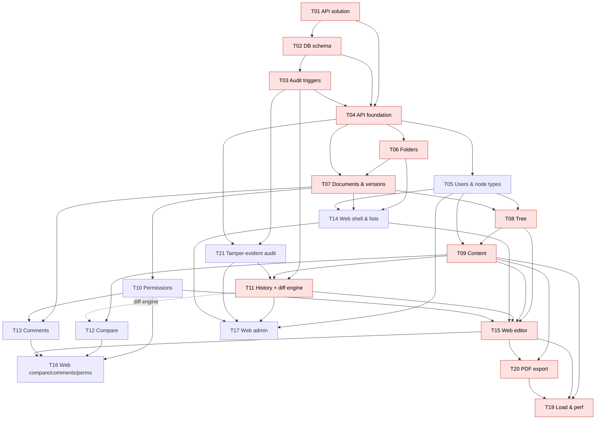

# Execution plan

Source requirements: [requirements/](../requirements/README.md) · Decisions: [architecture.md](../architecture.md) · Process: [process.md](../process.md) · **Operational queue: [work-queue.md](../work-queue.md)**

## 1. Task index

| ID | Task | Depends on | Size ([sizing](../process.md#9-sizing-and-agent-effort)) | Milestone |
|---|---|---|---|---|
| [T01](T01-api-solution-setup.md) | .NET API solution setup | — | S | M0 Foundation |
| [T02](T02-database-project-and-schema.md) | Database project & core schema | T01 | M | M0 Foundation |
| [T03](T03-database-change-tracking.md) | DB-level change tracking (audit triggers) | T02 | M | M0 Foundation |
| [T04](T04-api-foundation.md) | API foundation: EF Core, current user, errors, tests | T01, T02, T03 | M | M0 Foundation |
| [T05](T05-users-and-node-types-api.md) | Users, node types & content styles API | T04 | M | M1 Core API |
| [T06](T06-virtual-folders-api.md) | Virtual folders API | T04 | S–M | M1 Core API |
| [T07](T07-documents-and-versions-api.md) | Documents, multi-approver signing, restore | T04, T06 | L | M1 Core API |
| [T08](T08-document-tree-api.md) | Document tree API | T05, T07 | M | M1 Core API |
| [T09](T09-node-content-api.md) | Word-like styled content API (JSON schema) | T05, T08 | L | M1 Core API |
| [T10](T10-permissions.md) | Permissions (Owner/Editor/Approver) | T07 | M | M2 Advanced API |
| [T11](T11-change-history-api.md) | Change history API + diff engine + attributed diff | T03, T09 | L | M2 Advanced API |
| [T12](T12-version-comparison-api.md) | Version comparison API | T09 (+ diff engine) | M | M2 Advanced API |
| [T13](T13-comments-api.md) | Comments API | T07, T10 | S–M | M2 Advanced API |
| [T14](T14-web-shell-folders-documents.md) | Web: shell, folder tree, document list | T05, T06, T07 | M | M3 Web UI |
| [T15](T15-web-document-editor.md) | Web: section editor with inline per-section history & track changes, tree, signing | T08, T09, T10, T11, T14 | XL | M3 Web UI |
| [T16](T16-web-compare-comments-permissions.md) | Web: compare, comments, permissions | T10, T12, T13, T15 | M–L | M3 Web UI |
| [T17](T17-web-admin-tab.md) | Web: Admin tab (folders, node types, styles, users, audit) | T05, T11, T14 | M | M3 Web UI |

| ~~T18~~ | *Search — out of scope (decisions log Q13)* | – | – | – |
| [T21](T21-tamper-evident-audit.md) | Tamper-evident audit: temporal + ledger, deploy-script guard, reconciliation | T03, T04 | L | M0 Foundation |
| [T20](T20-pdf-export.md) | PDF export: async jobs, headless Chromium, cache, UI | T05, T07, T09, T10, T15 | L | M3 Web UI |
| [T19](T19-load-and-performance.md) | Load & performance harness + tuning | T07–T09 (harness), T10–T15, T20 (full mix) | L | M4 Performance |

**Effort** is measured in agent work, not person-days — see [process §9](../process.md#9-sizing-and-agent-effort). Initial estimate: ≈ 60–90 agent-hours in total, ≈ 35–75 h wall-clock with three parallel lanes (bounded below by the critical path, sized with the §9 table), plus waiting time on product-owner decisions; recalibrated from the actuals in the work queue after Q02–Q04. Load profile: [12-load-and-performance](../requirements/12-load-and-performance.md).

## 2. Dependency graph

Red = **critical path**: T01 → T02 → T03 → T04 → T06 → T07 → T08 → T09 → T11 → T15 → T20 → T19 → release candidate (Q20) — the longest dependency chain in the work queue.

## 3. Suggested sequencing

### One agent at a time
Follow [work-queue.md](../work-queue.md) top to bottom.

### Parallel agents (three lanes)
Items with a different lane letter in the work queue can run concurrently in separate agent sessions (each on its own branch), as soon as their dependencies are done:

| Lane | Scope | Order |
|---|---|---|
| A — backend core / DB | schema, audit, foundation, documents, tree, content, history | Q01 → Q02 → Q03 → Q04 → Q22 (T21) → Q07 → Q10 → Q11 → Q14 |
| B — backend features | dictionaries, folders, permissions, comments, compare, export, load | Q05, Q06 → Q09 → Q13 → Q15 → Q21 → Q19 |
| C — frontend | SPA against the committed OpenAPI snapshot | Q08 → Q12 → Q16 → Q17 |

Parallelization seams already designed into the tasks:
- **`IDocumentAuthorization`** (T07) lets T08/T09/T13 proceed while T10 is in progress.
- **`IVersionGuard`** (T07) is the single editability check for all mutating endpoints.
- **Diff engine** (T11 §3) is a standalone service — can be built by whichever track is free, then used by T11 and T12.
- **Generated TS client** (T14) — the frontend can start as soon as the OpenAPI contract for an area exists; endpoints may be stubbed.

## 4. Milestones & demo criteria

| Milestone | Tasks | Demo |
|---|---|---|
| **M0 Foundation** | T01–T04 | `dotnet test` green in CI with a real SQL container; DACPAC deploys; an API write shows up in `audit.ChangeLog` with the user; a manual SQL script change shows up as `Script`. |
| **M1 Core API** | T05–T09 | Via Scalar: create folder → document → build the example tree → edit content with a table → grant two approvers (DB rows until T10) → both sign → v1 → new draft → edit with styles/tables → both sign → v2 → delete → restore. |
| **M2 Advanced API** | T10–T13 | Node history across v1/v2/draft incl. a support-script change; compare v1 vs draft; approver comments; node-scoped editor restrictions. |
| **M4 Performance** | T19 | Scale-0.1 nightly green; full-scale run meets p99 ≤ 3 s at 20 req/s. |
| **M3 Web UI** | T14–T17 | Full scenario of M1 + M2 from the browser using the test-mode "Acting as" dropdown (owner → approvers), Playwright suite green. |

## 5. Definition of Done (applies to every task)

- Code committed with review GREEN; local verification green on a clean copy (Release build incl. DACPAC, all tests). CI is deferred until physically needed (decisions log Q17); PR/merge to `main` only on the product owner's request.
- Acceptance criteria covered by automated tests per [testing-strategy.md](../testing-strategy.md) (DB tests, unit, API integration incl. authz matrix, component, E2E).
- Review **GREEN** per [process.md](../process.md) — every artifact, only user-reachable defects count.
- New/changed endpoints appear in OpenAPI with request/response examples and ProblemDetails responses.
- Every mutating endpoint: validation → `IVersionGuard` (where applicable) → `IDocumentAuthorization` → concurrency via `rowVersion`.
- No schema change outside the SQL Database Project; EF mapping updated and the schema-drift test passes.
- Docs updated when behavior or decisions change (`requirements/*.md`, `architecture.md`, task file, decisions log).

## 6. Risks

| Risk | Mitigation |
|---|---|
| 3 s SLO at 20 req/s on 15 M node rows | `IsCurrent` filter, caching of immutable signed versions, SP hot paths, nightly load runs from Q19 on; tuning budget in T19. |
| Audit triggers slow down bulk operations (draft copy of large trees) | Set-based triggers; perf test in T07 (2 000 nodes < 2 s); `Operation` context key lets history collapse copy rows. |
| `audit.ChangeLog` grows fast (full HTML in JSON on each autosave) | Debounced autosave; skip no-op updates (T09 rule 5); plan retention/partitioning later; consider `COMPRESS()` for `OldValues/NewValues`. |
| Rich-text/table editing edge cases (merged cells) break diffs | Diff fixtures with merged cells in T11; normalized block model shared by T11/T12. |
| Support scripts bypass business rules (e.g. edit signed versions) | Cannot be prevented by design; made **visible**: `Source=Script`, ticket/reason, `modifiedAfterSigning` flag. |
| Test-mode auth leaks into production | Handler registered only when `Auth:Mode = Test`; startup fails in Production unless explicitly allowed; TEST MODE banner in the UI. |
| Word fidelity expectations exceed the editor | Fidelity scope is fixed by Content Schema v1 (content-format.md); fixture-based round-trip tests; unsupported Word features listed explicitly. |
| Multi-approver signing stalls when an approver is unavailable | Owner can revoke/replace approvers; finalization is re-checked on revoke. |
