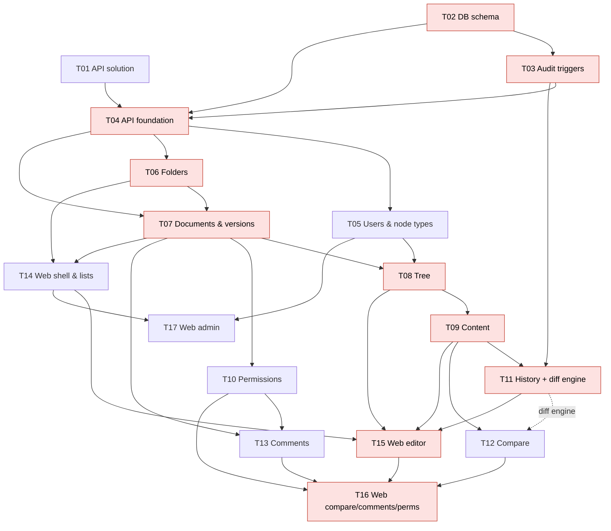

# Execution plan

Source requirements: [requirements.md](../requirements.md) · Decisions: [architecture.md](../architecture.md)

## 1. Task index

| ID | Task | Depends on | Size | Milestone |
|---|---|---|---|---|
| [T01](T01-api-solution-setup.md) | .NET API solution setup | — | S · 0.5–1 d | M0 Foundation |
| [T02](T02-database-project-and-schema.md) | Database project & core schema | — | M · 2–3 d | M0 Foundation |
| [T03](T03-database-change-tracking.md) | DB-level change tracking (audit triggers) | T02 | M · 2 d | M0 Foundation |
| [T04](T04-api-foundation.md) | API foundation: EF Core, current user, errors, tests | T01, T02, T03 | M · 2–3 d | M0 Foundation |
| [T05](T05-users-and-node-types-api.md) | Users & node-types API | T04 | S · 1 d | M1 Core API |
| [T06](T06-virtual-folders-api.md) | Virtual folders API | T04 | S–M · 1–1.5 d | M1 Core API |
| [T07](T07-documents-and-versions-api.md) | Documents & version lifecycle API | T04, T06 | M–L · 3 d | M1 Core API |
| [T08](T08-document-tree-api.md) | Document tree API | T05, T07 | M · 2–3 d | M1 Core API |
| [T09](T09-node-content-api.md) | Node rich-text content API | T08 | M · 2 d | M1 Core API |
| [T10](T10-permissions.md) | Permissions (Owner/Editor/Approver) | T07 | M · 2 d | M2 Advanced API |
| [T11](T11-change-history-api.md) | Change history API + diff engine | T03, T09 | M · 2–3 d | M2 Advanced API |
| [T12](T12-version-comparison-api.md) | Version comparison API | T09 (+ diff engine) | M · 2 d | M2 Advanced API |
| [T13](T13-comments-api.md) | Comments API | T07, T10 | S–M · 1.5 d | M2 Advanced API |
| [T14](T14-web-shell-folders-documents.md) | Web: shell, folder tree, document list | T06, T07 | M · 2–3 d | M3 Web UI |
| [T15](T15-web-document-editor.md) | Web: document form (tree, editor, history, versions) | T08, T09, T11, T14 | L · 4–5 d | M3 Web UI |
| [T16](T16-web-compare-comments-permissions.md) | Web: compare, comments, permissions | T10, T12, T13, T15 | M–L · 3–4 d | M3 Web UI |
| [T17](T17-web-admin-tab.md) | Web: Admin tab | T05, T14 | S–M · 1.5 d | M3 Web UI |

**Total effort ≈ 35–40 developer-days.**

## 2. Dependency graph

Red = **critical path**: T02 → T03 → T04 → T06 → T07 → T08 → T09 → T11 → T15 → T16 (≈ 26 days for one developer).

## 3. Suggested sequencing

### Option A — one developer (strict order)
T01 → T02 → T03 → T04 → T05 → T06 → T07 → T08 → T09 → T10 → T11 → T12 → T13 → T14 → T15 → T17 → T16

### Option B — three parallel tracks (≈ 5 weeks)

| Week | Track 1 — Backend / DB | Track 2 — Backend / API | Track 3 — Frontend |
|---|---|---|---|
| 1 | T02 → T03 | T01 → (help T02: seed, SQL tests) | UI kit choice, T14 scaffold against mocks from the OpenAPI draft |
| 2 | T04 | T05, T06 | T14 (shell, user switcher, folder tree) |
| 3 | T07 | T10 (on the T07 authorization seam) | T14 finish (doc list), T17 |
| 4 | T08 → T09 | T13, diff engine (T11 §3) | T15 (tree panel, version bar) |
| 5 | T11 | T12 | T15 (editor, history) → T16 |
| 6 | stabilization, performance tests | stabilization | T16, Playwright smoke suite |

Parallelization seams already designed into the tasks:
- **`IDocumentAuthorization`** (T07) lets T08/T09/T13 proceed while T10 is in progress.
- **`IVersionGuard`** (T07) is the single editability check for all mutating endpoints.
- **Diff engine** (T11 §3) is a standalone service — can be built by whichever track is free, then used by T11 and T12.
- **Generated TS client** (T14) — the frontend can start as soon as the OpenAPI contract for an area exists; endpoints may be stubbed.

## 4. Milestones & demo criteria

| Milestone | Tasks | Demo |
|---|---|---|
| **M0 Foundation** | T01–T04 | `dotnet test` green in CI with a real SQL container; DACPAC deploys; an API write shows up in `audit.ChangeLog` with the user; a manual SQL script change shows up as `Script`. |
| **M1 Core API** | T05–T09 | Via Scalar: create folder → document → build the example tree → edit content with a table → grant approver (DB row until T10) → approver signs v1 → new draft → edit → sign v2. |
| **M2 Advanced API** | T10–T13 | Node history across v1/v2/draft incl. a support-script change; compare v1 vs draft; approver comments; node-scoped editor restrictions. |
| **M3 Web UI** | T14–T17 | Full scenario of M1 + M2 from the browser, Playwright smoke suite green. |

## 5. Definition of Done (applies to every task)

- Code merged to `main` via PR with review; CI green (build, tests, lint; DACPAC build for DB changes).
- Acceptance criteria of the task are covered by automated tests (integration tests for API, SQL test scripts for DB, component/E2E tests for UI).
- New/changed endpoints appear in OpenAPI with request/response examples and ProblemDetails responses.
- Every mutating endpoint: validation → `IVersionGuard` (where applicable) → `IDocumentAuthorization` → concurrency via `rowVersion`.
- No schema change outside the SQL Database Project; EF mapping updated and the schema-drift test passes.
- Docs updated when behavior or decisions change (`requirements.md`, `architecture.md`, task file).

## 6. Risks

| Risk | Mitigation |
|---|---|
| Audit triggers slow down bulk operations (draft copy of large trees) | Set-based triggers; perf test in T07 (2 000 nodes < 2 s); `Operation` context key lets history collapse copy rows. |
| `audit.ChangeLog` grows fast (full HTML in JSON on each autosave) | Debounced autosave; skip no-op updates (T09 rule 5); plan retention/partitioning later; consider `COMPRESS()` for `OldValues/NewValues`. |
| Rich-text/table editing edge cases (merged cells) break diffs | Diff fixtures with merged cells in T11; normalized block model shared by T11/T12. |
| Support scripts bypass business rules (e.g. edit signed versions) | Cannot be prevented by design; made **visible**: `Source=Script`, ticket/reason, `modifiedAfterSigning` flag. |
| Dev auth leaks into production | `DevHeaderAuthenticationHandler` registered only when `Auth:Mode = DevHeader`; startup fails in Production with that mode. |
