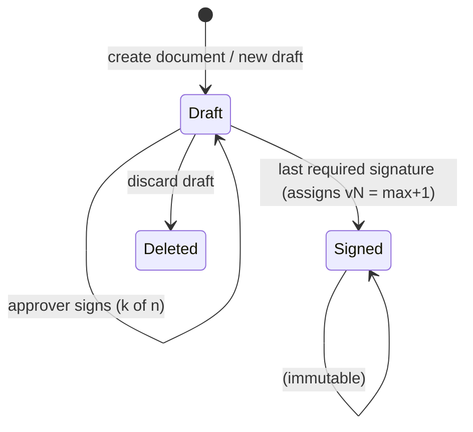

# T07 — Documents and version lifecycle API

| | |
|---|---|
| **Depends on** | T04, T06 |
| **Blocks** | T08, T10, T12, T13, T14 |
| **Size** | L (3.5–4 days) |
| **Requirements** | FR-F3, FR-V1 … FR-V8, FR-H5 |
| **Read first** (nothing else) | [01-folders](../requirements/01-folders.md) · [03-versioning-and-signing](../requirements/03-versioning-and-signing.md) · [04-change-tracking](../requirements/04-change-tracking.md) · [architecture](../architecture.md) (only sections linked in the text) · [process](../process.md) |

## Goal
Create/list/delete documents and drive the version lifecycle: **Draft → Signed (vN)**, **new Draft from Signed**, **discard Draft**.

## State model

Document level: `DeletedAt` set → document status **Deleted**, all its versions become read-only.
Derived document status for lists: `Deleted` if deleted; else `Draft` if a draft exists; else `Signed`.

## API

### Documents
| Method | Route | Who | Notes |
|---|---|---|---|
| GET | `/api/folders/{folderId}/documents?includeDeleted=false&page&pageSize` | any | `{ id, title, status, latestSignedVersion (int?), hasDraft, owner {id,displayName}, modifiedAt }` |
| POST | `/api/documents` | any | `{ folderId, title }` → creates Document (owner = current user) **and** an empty Draft version in one transaction → `201 { id, draftVersionId }` |
| GET | `/api/documents/{id}` | any | details + `versions: [{ id, status, versionNumber, label, createdAt, createdBy, signedAt, signedBy, basedOnVersionId, modifiedAfterSigning }]`, `myRoles` (owner/editor/approver + node scopes) |
| PUT | `/api/documents/{id}` | owner | `{ title, rowVersion }` — only if the document has a draft (**assumption**: title is edited together with the draft) |
| POST | `/api/documents/{id}/move` | owner | `{ folderId, rowVersion }` |
| DELETE | `/api/documents/{id}` | owner | soft delete (`DeletedAt`, `DeletedByUserId`) |
| POST | `/api/documents/{id}/restore` | owner, admin | clears `DeletedAt`; `409` if not deleted; the folder must still exist (else `409`, admin can move it first) |

### Versions
| Method | Route | Who | Notes |
|---|---|---|---|
| GET | `/api/versions/{versionId}` | any | version header |
| GET | `/api/versions/{versionId}/signatures` | any | `{ requiredApprovers: [user], signatures: [{ user, signedAt, isValid, comment }], pendingApprovers: [user], isComplete }` — `isValid = false` when the draft changed after signing (outdated) |
| POST | `/api/versions/{versionId}/signatures` | **approver** | `{ comment? }` — records my signature with the current content hash (replaces my outdated one); if now **all** current approvers hold valid signatures → finalize (see rule 2); returns the signature status + version header |
| DELETE | `/api/versions/{versionId}/signatures/mine` | approver | withdraw my signature (Draft only) |
| POST | `/api/documents/{id}/drafts` | owner | no body — always copied from the **latest signed** version; `409 draft-already-exists` if a draft exists; `409` if no signed version exists |
| DELETE | `/api/versions/{versionId}` | owner | discard draft → `Status = Deleted`; only Drafts; if it is the only version of the document the document is deleted as well (**assumption**) |

`label` = `v{n}` for signed, `Draft` / `Draft (based on v{n})` for drafts, `Discarded draft` for deleted.

## Rules
1. **Editability guard** — implement once as a reusable service, e.g. `IVersionGuard.EnsureEditable(versionId)`: throws `409 version-not-editable` unless `version.Status == Draft && document.DeletedAt == null`. **All** mutating endpoints of T08, T09 (and T07 title) must call it.
2. **Signing — all approvers must sign** (FR-V6):
   - `POST …/signatures` (Draft only, `CanSign` = has an Approver grant): compute the current draft hash (canonical tree serialization below), upsert my `VersionSignature` with that hash.
   - A signature is **valid** iff `WithdrawnAt IS NULL AND ContentHash = current draft hash` — computed lazily, so edits made by the API *or by scripts* automatically outdate signatures.
   - **Finalize** when every user with an Approver grant on the document has a valid signature (single transaction, `UPDLOCK` on the document's versions, re-check inside the lock): `VersionNumber = ISNULL(MAX(VersionNumber), 0) + 1`, `Status = Signed`, `SignedAt`, `SignedContentHash` = the hash.
   - Finalization is also re-checked when an Approver grant is **revoked** (T10), since the remaining approvers may already all have signed.
   - Zero approvers → signing is impossible (`409 no-approvers`). Empty document (no nodes) → `400`.
   - The canonical serialization: nodes ordered depth-first by `SortOrder`, each as `LogicalNodeId|ParentLogicalNodeId|NodeTypeCode|Title|ContentHash`. Put the serializer in `DocHub.Domain` so T11/T12 reuse it.
3. **New draft** = deep copy (single transaction, set-based SQL is preferred over EF graph cloning for large trees):
   - new `DocumentVersion(Status=Draft, BasedOnVersionId=latest signed)`;
   - copy all `DocumentNode` rows keeping `LogicalNodeId`, remapping `ParentNodeId` (e.g. `MERGE … OUTPUT` old→new id map into a temp table);
   - copy all `NodeContent` rows;
   - set `SESSION_CONTEXT(N'Operation') = 'CopyVersion'` for the copy so history (T11) collapses the inserted rows.
   - Permissions are per document and comments per version → nothing else to copy.
4. **modifiedAfterSigning** — on `GET /api/documents/{id}`, recompute the hash for signed versions and compare with `SignedContentHash` (cache per version + `max(ChangeLog.Id)` to keep it cheap). Detects support-script edits (FR-H5).
5. **Authorization seam** — introduce `IDocumentAuthorization` with methods `CanManage(docId)` (lifecycle, roles), `CanEditStructure(docId)`, `CanEditContent(docId, logicalNodeId)`, `CanSign(docId)`, `CanComment(docId)`, `CanResolve(docId)`. In this task implement `CanManage`/`CanEditStructure`/`CanEditContent` as **owner-only** and `CanSign` as "has an `Approver` row in `app.DocumentPermission`" (and "required approvers" = all such rows) (tests insert the grant directly into the DB until T10 adds the API); T10 replaces the implementation with the full role logic. T08/T09/T13 call only this interface, so they can be built in parallel with T10.
6. Deleted documents: `GET` by id still works (read-only, `status = Deleted`) so history can be viewed; lists exclude them unless `includeDeleted=true`.

## Acceptance criteria
- [ ] Create → Draft exists, no version number; list shows status `Draft`.
- [ ] With approvers carol and dave: carol signs → still Draft (1 of 2); dave signs → `v1`. New draft → copy with identical tree/content and same `LogicalNodeId`s; both sign → `v2`.
- [ ] carol signs, owner edits content, dave signs → still Draft; carol's signature is reported `isValid = false`; carol signs again → finalized.
- [ ] Revoking dave's approver grant while carol has a valid signature finalizes the version.
- [ ] Restore a deleted document → visible in the folder list again.
- [ ] Second draft → `409 draft-already-exists`. Sign a Signed version → `409 version-not-editable`.
- [ ] Non-owner delete/new-draft/discard → `403`. Signing by the owner or an editor → `403`.
- [ ] Deep copy of a 2 000-node / depth-15 tree completes in < 2 s locally (test with generated data).
- [ ] Direct SQL `UPDATE` of content in a signed version → `modifiedAfterSigning = true` for that version.
- [ ] Two approvers signing concurrently as the last two signatures → exactly one version number is assigned.
