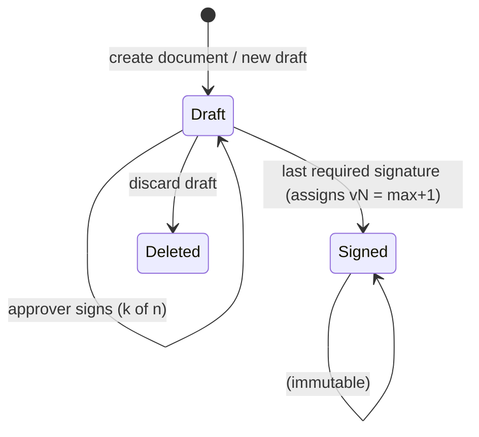

# T07 — Documents and version lifecycle API

| | |
|---|---|
| **Depends on** | T04, T06 |
| **Blocks** | T08, T10, T12, T13, T14 |
| **Size** | L (3.5–4 days) |
| **Requirements** | FR-F3, FR-V1 … FR-V8, FR-H5, FR-P5, FR-D1 … FR-D3, FR-D5 |
| **Read first** (nothing else) | [01-folders](../requirements/01-folders.md) · [03-versioning-and-signing](../requirements/03-versioning-and-signing.md) · [06-permissions](../requirements/06-permissions.md) (FR-P5) · [11-data-access](../requirements/11-data-access.md) · [04-change-tracking](../requirements/04-change-tracking.md) · [architecture](../architecture.md) (only sections linked in the text) · [process](../process.md) |

## Goal
Create/list/delete documents and drive the version lifecycle: **Draft → Signed (vN)**, **new Draft from Signed**, **discard Draft**.

## State model

Document level: `DeletedAt` set → document status **Deleted**, all its versions become read-only.
Derived document status for lists: `Deleted` if deleted; else `Draft` if a draft exists; else `Signed`.

## API

### Documents
| Method | Route | Who | Notes |
|---|---|---|---|
| GET | `/api/folders/{folderId}/documents?includeDeleted=false&includeSubfolders=false&search=(substring of title)&status=&sortBy=&sortDir=&page&pageSize` | any | backed by **`app.usp_ListDocuments`** ([FR-D2](../requirements/11-data-access.md)) → `{ items: [{ id, rowVersion, title, status, latestSignedVersion (int?), hasDraft, signatureProgress {signed, required}?, owner {id,displayName}, myRoles, modifiedAt }], totalCount }`; `search` is a **case/accent-insensitive substring filter on the title** within the folder (bounded by the folder index, ~100 rows per folder); the UI labels it "Filter by title" to distinguish it from full-text *Search everywhere* (T18, word/prefix); `includeDeleted` returns deleted documents only to their owner and admins (FR-P5) |
| POST | `/api/documents` | any | `{ folderId, title }` → creates Document (owner = current user) **and** an empty Draft version in one transaction → `201 { id, draftVersionId }` |
| GET | `/api/documents/{id}` | any (deleted: owner/admin only, else `404`) | details + `versions: [{ id, rowVersion, status, versionNumber, label, createdAt, createdBy, signedAt, signedBy, basedOnVersionId, modifiedAfterSigning }]`, `myRoles` (owner/editor/approver + node scopes) |
| PUT | `/api/documents/{id}` | owner | `{ title, rowVersion }` — document-level title, allowed on any non-deleted document, does not affect signatures (decision log A-1) |
| POST | `/api/documents/{id}/move` | owner, admin | `{ folderId, rowVersion }` — admin may also move **deleted** documents (organizational exception to rule 1, needed to empty folders — FR-F4) |
| DELETE | `/api/documents/{id}?rowVersion=…` | owner | soft delete (`DeletedAt`, `DeletedByUserId`); **version statuses are not changed**, so restore returns the document exactly as it was (incl. its draft and collected signatures) |
| POST | `/api/documents/{id}/restore` | owner, admin | `{ folderId? }` clears `DeletedAt`; `409 not-deleted` if not deleted; `folderId` optionally restores into another folder (required when the original folder no longer exists → `409 folder-missing` without it) |

### Versions
| Method | Route | Who | Notes |
|---|---|---|---|
| GET | `/api/versions/{versionId}` | any | version header |
| GET | `/api/versions/{versionId}/signatures` | any | `{ requiredApprovers: [user], signatures: [{ user, signedAt, isValid, comment }], pendingApprovers: [user], isComplete }` — `isValid = false` when the draft changed after signing (outdated) |
| POST | `/api/versions/{versionId}/signatures` | **approver** | `{ comment? }` — records my signature with the current content hash (replaces my outdated one); if now **all** current approvers hold valid signatures → finalize (see rule 2); returns the signature status + version header |
| DELETE | `/api/versions/{versionId}/signatures/mine` | approver | withdraw my signature (Draft only) |
| POST | `/api/documents/{id}/drafts` | owner | no body — always copied from the **latest signed** version via **`app.usp_CopyVersionToDraft`** (FR-D3); `409 draft-already-exists` if a draft exists; `409 no-signed-version` if none exists |
| DELETE | `/api/versions/{versionId}?rowVersion=…` | owner | discard draft → `Status = Deleted`; only Drafts; allowed only when the document has a signed version (`409 only-version` otherwise — delete the document instead; decision log A-2) |

`label` = `v{n}` for signed, `Draft` / `Draft (based on v{n})` for drafts, `Discarded draft` for deleted.

## Rules
1. **Guards** — implement once as a reusable service:
   - `IVersionGuard.EnsureEditable(versionId)`: `409 document-deleted` if the document is deleted, else `409 version-not-editable` unless `version.Status == Draft`. Called by all mutating endpoints of T08, T09, sign/withdraw and discard.
   - `IVersionGuard.EnsureDocumentActive(documentId)`: `409 document-deleted` if `DeletedAt` is set. Called by **every** other mutation on a document — rename, move (except admin), new draft, grant/revoke (T10), comments (T13), transfer ownership. Only `restore` and admin `move` work on deleted documents.
2. **Signing — all approvers must sign** (FR-V6):
   - `POST …/signatures` (`EnsureEditable`, `CanSign` = has an Approver grant): compute the current draft hash (canonical tree serialization below), upsert my `VersionSignature` with that hash.
   - A signature is **valid** iff `WithdrawnAt IS NULL AND ContentHash = current draft hash` — computed lazily, so edits made by the API *or by scripts* automatically outdate signatures.
   - **Finalize** when the document has **at least one** Approver grant **and** every user with an Approver grant has a valid signature (single transaction, `UPDLOCK` on the document's versions, re-check inside the lock): `VersionNumber = ISNULL(MAX(VersionNumber), 0) + 1`, `Status = Signed`, `SignedAt`, `SignedContentHash` = the hash.
   - Finalization is also re-checked when an Approver grant is **revoked** (T10), since the remaining approvers may already all have signed — with the same "at least one approver" condition, so revoking the last approver never signs the draft.
   - Zero approvers → signing is impossible (`409 no-approvers`). Empty document (no nodes) → `400`.
   - The canonical serialization: nodes ordered depth-first by `SortOrder`, each as `LogicalNodeId|ParentLogicalNodeId|NodeTypeId|Title|SHA-256(canonical ContentJson)`. `NodeTypeId` (not the editable code) keeps admin dictionary edits from outdating signatures or raising false tamper flags. The content part is **recomputed from `ContentJson`**, never taken from the stored `ContentHash` column, so script edits are always detected. Put the serializer in `DocHub.Domain` so T11/T12 reuse it.
3. **New draft** = deep copy in stored procedure **`app.usp_CopyVersionToDraft @SourceVersionId, @UserId`** (single transaction, set-based — FR-D3):
   - new `DocumentVersion(Status=Draft, BasedOnVersionId=latest signed)`;
   - copy all `DocumentNode` rows keeping `LogicalNodeId`, remapping `ParentNodeId` (e.g. `MERGE … OUTPUT` old→new id map into a temp table);
   - copy all `NodeContent` rows (with their derived columns) **and their `ContentStyleUsage` rows**;
   - set `SESSION_CONTEXT(N'OperationContext') = 'CopyVersion'` for the copy (and clear it afterwards) so history (T11) collapses the inserted rows.
   - Permissions are per document and comments per version → nothing else to copy.
4. **modifiedAfterSigning** = `VersionStamp.TamperedAt IS NOT NULL` — a single indexed read, no hash recomputation on document open (NFR-L5). The detail view (T11 history) can additionally recompute the hash from `ContentJson` and report whether content still differs from `SignedContentHash` (cached by `LastChangeLogId`). Detects support-script edits (FR-H5).
5. **Authorization seam** — introduce `IDocumentAuthorization` with methods `CanManage(docId)` (lifecycle, roles), `CanEditStructure(docId)`, `CanEditContent(docId, logicalNodeId)`, `CanSign(docId)`, `CanComment(docId)`, `CanResolve(docId)`. In this task implement `CanManage`/`CanEditStructure`/`CanEditContent` as **owner-only** and `CanSign` as "has an `Approver` row in `app.DocumentPermission`" (and "required approvers" = all such rows) (tests insert the grant directly into the DB until T10 adds the API); T10 replaces the implementation with the full role logic. T08/T09/T13 call only this interface, so they can be built in parallel with T10.
6. Deleted documents: visible read-only (`status = Deleted`, incl. history/compare) **to the owner and admins only**; other users get `404`. Implement once as `IDocumentAuthorization.EnsureCanView(documentId)` (`usp_CheckPermission` action `View`) — **every read endpoint that takes a document, version, node or comment id** (T07, T08, T09, T11, T12, T13, T18) must call it — including T10 `GET /permissions` and `/my-permissions`. Lists exclude them unless `includeDeleted=true`.
7. **`IsCurrent`** (NFR-L8): set on the new draft by create / new draft (and cleared on the signed version it replaces), moved back to the latest signed version on discard, kept on the version when it is finalized. Always changed inside the same transaction; a DB test checks exactly one current version per non-empty document.
8. **Caching** (NFR-L9): version reads return `ETag` = `VersionStamp.LastChangeLogId` (advanced also by status and signature changes, T03 §2b) with `Cache-Control: private, no-cache`, `Vary: X-User-Id`, honoring `If-None-Match` → `304`; `EnsureCanView` runs before any cache hit.
9. **Data access** ([FR-D1/D2](../requirements/11-data-access.md)): all CRUD through EF Core; the list endpoint through `app.usp_ListDocuments`, the deep copy through `app.usp_CopyVersionToDraft`. Both procedures live in the DB project with DB tests.

## Acceptance criteria
- [ ] Create → Draft exists, no version number; list shows status `Draft`.
- [ ] With approvers carol and dave: carol signs → still Draft (1 of 2); dave signs → `v1`. New draft → copy with identical tree/content and same `LogicalNodeId`s; both sign → `v2`.
- [ ] carol signs, owner edits content, dave signs → still Draft; carol's signature is reported `isValid = false`; carol signs again → finalized.
- [ ] Revoking dave's approver grant while carol has a valid signature finalizes the version.
- [ ] Only approver carol, no signatures: revoking carol does **not** finalize; the draft stays Draft and signing returns `409 no-approvers`.
- [ ] On a deleted document: rename, sign, withdraw, discard, new draft, grant/revoke, comment, owner move → exactly `409 document-deleted`; admin move and restore work. On a non-deleted document, sign/discard/edit of a Signed version → exactly `409 version-not-editable`.
- [ ] A style used only in a freshly created draft → style delete `409 in-use`.
- [ ] After the last approver signs, revalidating the version header returns `200` with `Signed` (no stale `304`).
- [ ] Admin renames a node-type `code` → no signature becomes outdated, no `modifiedAfterSigning` flag.
- [ ] Direct SQL update of `ContentJson` (not `ContentHash`) in a draft → existing signatures reported `isValid = false`.
- [ ] Discard the only version → `409 only-version`. Restore into another folder via `folderId`; restore without `folderId` when the folder is gone → `409 folder-missing`.
- [ ] Non-owner/non-admin `GET` of a deleted document → `404`; list with `includeDeleted` shows only own deleted documents.
- [ ] `usp_ListDocuments` page of 50 < 100 ms on the NFR-6 data set (tagged perf test, FR-D5).
- [ ] List endpoint results equal an EF-built reference query for sorting, paging, `search`, `status`, `includeSubfolders` (proves the SP contract).
- [ ] Restore a deleted document → visible in the folder list again, with its draft and signatures unchanged.
- [ ] Second draft → `409 draft-already-exists`. Sign a Signed version → `409 version-not-editable`.
- [ ] Non-owner delete/new-draft/discard → `403`. Signing by the owner or an editor → `403`.
- [ ] Deep copy of a 2 000-node / depth-15 tree completes in < 2 s locally (test with generated data).
- [ ] Direct SQL `UPDATE` of content in a signed version → `modifiedAfterSigning = true` for that version.
- [ ] Two approvers signing concurrently as the last two signatures → exactly one version number is assigned.
