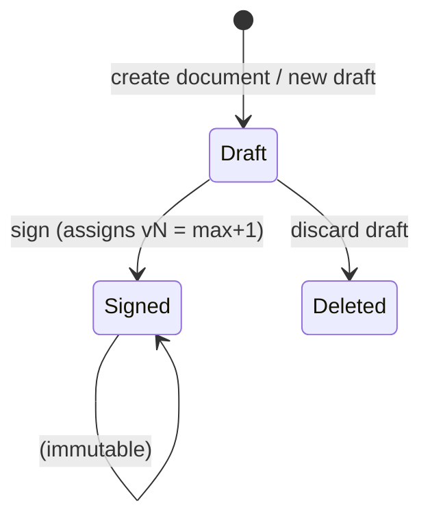

# T07 — Documents and version lifecycle API

| | |
|---|---|
| **Depends on** | T04, T06 |
| **Blocks** | T08, T10, T12, T13, T14 |
| **Size** | M–L (3 days) |
| **Requirements** | FR-F3, FR-V1 … FR-V6, FR-H5 |

## Goal
Create/list/delete documents and drive the version lifecycle: **Draft → Signed (vN)**, **new Draft from Signed**, **discard Draft**.

## State model

Document level: `DeletedAt` set → document status **Deleted**, all its versions become read-only.
Derived document status for lists: `Deleted` if deleted; else `Draft` if a draft exists; else `Signed`.

## API

### Documents
| Method | Route | Who | Notes |
|---|---|---|---|
| GET | `/api/folders/{folderId}/documents?includeDeleted=false&page&pageSize` | any | `{ id, title, status, latestSignedVersion (int?), hasDraft, owner {id,displayName}, modifiedAt }` |
| POST | `/api/documents` | any | `{ folderId, title }` → creates Document (owner = current user) **and** an empty Draft version in one transaction → `201 { id, draftVersionId }` |
| GET | `/api/documents/{id}` | any | details + `versions: [{ id, status, versionNumber, label, createdAt, createdBy, signedAt, signedBy, basedOnVersionId, modifiedAfterSigning }]`, `myRoles` (owner/editor/approver + node scopes) |
| PUT | `/api/documents/{id}` | owner, doc-editor | `{ title, rowVersion }` — only if the document has a draft (**assumption**: title is edited together with the draft) |
| POST | `/api/documents/{id}/move` | owner | `{ folderId, rowVersion }` |
| DELETE | `/api/documents/{id}` | owner | soft delete (`DeletedAt`, `DeletedByUserId`) |

### Versions
| Method | Route | Who | Notes |
|---|---|---|---|
| GET | `/api/versions/{versionId}` | any | version header |
| POST | `/api/versions/{versionId}/sign` | owner | `{ rowVersion }` — Draft only |
| POST | `/api/documents/{id}/drafts` | owner | `{ sourceVersionId? }` — default: latest signed; `409 draft-already-exists` if a draft exists |
| DELETE | `/api/versions/{versionId}` | owner | discard draft → `Status = Deleted`; only Drafts; if it is the only version of the document the document is deleted as well (**assumption**) |

`label` = `v{n}` for signed, `Draft` / `Draft (based on v{n})` for drafts, `Discarded draft` for deleted.

## Rules
1. **Editability guard** — implement once as a reusable service, e.g. `IVersionGuard.EnsureEditable(versionId)`: throws `409 version-not-editable` unless `version.Status == Draft && document.DeletedAt == null`. **All** mutating endpoints of T08, T09 (and T07 title) must call it.
2. **Sign** (single transaction, `UPDLOCK` on the document's versions):
   - `VersionNumber = ISNULL(MAX(VersionNumber), 0) + 1` for the document;
   - `Status = Signed`, `SignedAt`, `SignedByUserId`;
   - `SignedContentHash` = SHA-256 of a **canonical serialization** of the tree: nodes ordered depth-first by `SortOrder`, each as `LogicalNodeId|ParentLogicalNodeId|NodeTypeCode|Title|ContentHash`. Put the serializer in `DocHub.Domain` so T11/T12 reuse it.
   - Signing an empty document (no nodes) → `400 validation-failed`.
3. **New draft** = deep copy (single transaction, set-based SQL is preferred over EF graph cloning for large trees):
   - new `DocumentVersion(Status=Draft, BasedOnVersionId=source)`;
   - copy all `DocumentNode` rows keeping `LogicalNodeId`, remapping `ParentNodeId` (e.g. `MERGE … OUTPUT` old→new id map into a temp table);
   - copy all `NodeContent` rows;
   - set `SESSION_CONTEXT(N'Operation') = 'CopyVersion'` for the copy so history (T11) collapses the inserted rows.
   - Permissions are per document and comments per version → nothing else to copy.
4. **modifiedAfterSigning** — on `GET /api/documents/{id}`, recompute the hash for signed versions and compare with `SignedContentHash` (cache per version + `max(ChangeLog.Id)` to keep it cheap). Detects support-script edits (FR-H5).
5. **Authorization seam** — introduce `IDocumentAuthorization` with methods such as `CanManage(docId)`, `CanEditDocument(docId)`, `CanEditNode(docId, logicalNodeId)`, `CanComment(docId)`. In this task implement it as **owner-only**; T10 replaces the implementation with full role logic. T08/T09/T13 call only this interface, so they can be built in parallel with T10.
6. Deleted documents: `GET` by id still works (read-only, `status = Deleted`) so history can be viewed; lists exclude them unless `includeDeleted=true`.

## Acceptance criteria
- [ ] Create → Draft exists, no version number; list shows status `Draft`.
- [ ] Sign → `v1`; new draft → copy with identical tree/content and same `LogicalNodeId`s; sign → `v2`.
- [ ] Second draft → `409 draft-already-exists`. Sign a Signed version → `409 version-not-editable`.
- [ ] Non-owner sign/delete/new-draft → `403`.
- [ ] Deep copy of a 2 000-node / depth-15 tree completes in < 2 s locally (test with generated data).
- [ ] Direct SQL `UPDATE` of content in a signed version → `modifiedAfterSigning = true` for that version.
- [ ] Two concurrent sign requests on the same draft → exactly one succeeds.
